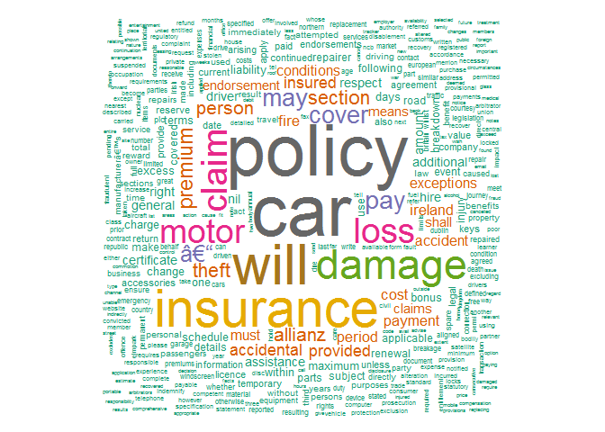
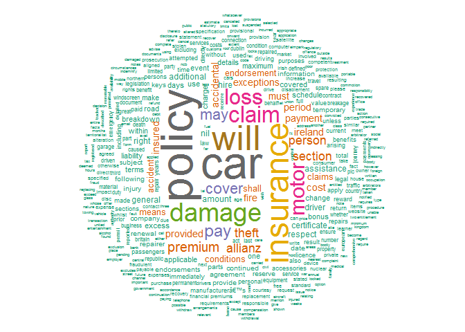

Acceso a las librerias
----------------------

    library(tm)

    ## Loading required package: NLP

    library(RColorBrewer)
    library(wordcloud)

    ## Warning: package 'wordcloud' was built under R version 3.3.1

Descargamos el PDF de un Seguro de Auto.
----------------------------------------

    url <- "https://www.allianz.ie/car-insurance/faqs/motor_policy_document_0412.pdf"
    dest <- ("autoallianz.pdf")
    download.file(url, dest, mode = "wb")

### Leemos el documento

    Rpdf <- readPDF(control = list(text = "-layout"))

### Lo pasamos a formato Corpus

    poliza <- Corpus(URISource("autoallianz.pdf"), readerControl = list(reader = Rpdf))

Analizamos el contenido, poliza$content

    inspect(poliza)

    ## <<VCorpus>>
    ## Metadata:  corpus specific: 0, document level (indexed): 0
    ## Content:  documents: 1
    ## 
    ## [[1]]
    ## <<PlainTextDocument>>
    ## Metadata:  7
    ## Content:  chars: 72926

### Eliminamos espacios en Blanco, Números, Puntuación....

    poliza <- tm_map(poliza, stripWhitespace)
    poliza <- tm_map(poliza, removeNumbers)
    poliza <- tm_map(poliza, content_transformer(tolower))
    print(stopwords("en"))

    ##   [1] "i"          "me"         "my"         "myself"     "we"        
    ##   [6] "our"        "ours"       "ourselves"  "you"        "your"      
    ##  [11] "yours"      "yourself"   "yourselves" "he"         "him"       
    ##  [16] "his"        "himself"    "she"        "her"        "hers"      
    ##  [21] "herself"    "it"         "its"        "itself"     "they"      
    ##  [26] "them"       "their"      "theirs"     "themselves" "what"      
    ##  [31] "which"      "who"        "whom"       "this"       "that"      
    ##  [36] "these"      "those"      "am"         "is"         "are"       
    ##  [41] "was"        "were"       "be"         "been"       "being"     
    ##  [46] "have"       "has"        "had"        "having"     "do"        
    ##  [51] "does"       "did"        "doing"      "would"      "should"    
    ##  [56] "could"      "ought"      "i'm"        "you're"     "he's"      
    ##  [61] "she's"      "it's"       "we're"      "they're"    "i've"      
    ##  [66] "you've"     "we've"      "they've"    "i'd"        "you'd"     
    ##  [71] "he'd"       "she'd"      "we'd"       "they'd"     "i'll"      
    ##  [76] "you'll"     "he'll"      "she'll"     "we'll"      "they'll"   
    ##  [81] "isn't"      "aren't"     "wasn't"     "weren't"    "hasn't"    
    ##  [86] "haven't"    "hadn't"     "doesn't"    "don't"      "didn't"    
    ##  [91] "won't"      "wouldn't"   "shan't"     "shouldn't"  "can't"     
    ##  [96] "cannot"     "couldn't"   "mustn't"    "let's"      "that's"    
    ## [101] "who's"      "what's"     "here's"     "there's"    "when's"    
    ## [106] "where's"    "why's"      "how's"      "a"          "an"        
    ## [111] "the"        "and"        "but"        "if"         "or"        
    ## [116] "because"    "as"         "until"      "while"      "of"        
    ## [121] "at"         "by"         "for"        "with"       "about"     
    ## [126] "against"    "between"    "into"       "through"    "during"    
    ## [131] "before"     "after"      "above"      "below"      "to"        
    ## [136] "from"       "up"         "down"       "in"         "out"       
    ## [141] "on"         "off"        "over"       "under"      "again"     
    ## [146] "further"    "then"       "once"       "here"       "there"     
    ## [151] "when"       "where"      "why"        "how"        "all"       
    ## [156] "any"        "both"       "each"       "few"        "more"      
    ## [161] "most"       "other"      "some"       "such"       "no"        
    ## [166] "nor"        "not"        "only"       "own"        "same"      
    ## [171] "so"         "than"       "too"        "very"

    poliza <- tm_map(poliza, removeWords, stopwords("en"))
    poliza_corpus <- tm_map(poliza,removePunctuation)

Word Cloud
----------

    wordcloud(poliza_corpus, max.words=800, random.order=FALSE, scale= c(5, 0.3), colors=brewer.pal(8,"Dark2"))

    ## Warning in wordcloud(poliza_corpus, max.words = 800, random.order =
    ## FALSE, : withdraw could not be fit on page. It will not be plotted.

    ## Warning in wordcloud(poliza_corpus, max.words = 800, random.order =
    ## FALSE, : withdrawal could not be fit on page. It will not be plotted.

\#\#\#Miramos el contenido después de aplicar tm\_map

    inspect(poliza_corpus) 

    ## <<VCorpus>>
    ## Metadata:  corpus specific: 0, document level (indexed): 0
    ## Content:  documents: 1
    ## 
    ## [[1]]
    ## <<PlainTextDocument>>
    ## Metadata:  7
    ## Content:  chars: 43564

writeLines(as.character(poliza\_corpus\[\[1\]\]))

Matriz de Frecuencias
---------------------

    poliza_matrix <- DocumentTermMatrix(poliza_corpus) #matriz original de frecuencias

### Términos más frecuentes en el Documento

    findFreqTerms(poliza_matrix, 100)#aparecen mas de 100 veces

    ## [1] "car"       "insurance" "policy"    "will"

    findFreqTerms(poliza_matrix,25)#aparecen más de 50 veces

    ##  [1] "–"        "accidental" "allianz"    "car"        "claim"     
    ##  [6] "cover"      "damage"     "insurance"  "insured"    "loss"      
    ## [11] "may"        "motor"      "pay"        "person"     "policy"    
    ## [16] "premium"    "provided"   "section"    "theft"      "will"

    freq.term <- findFreqTerms(poliza_matrix,lowfreq = 15)
    freq.term

    ##  [1] "–"         "accident"    "accidental"  "additional"  "allianz"    
    ##  [6] "amount"      "assistance"  "bonus"       "breakdown"   "car"        
    ## [11] "certificate" "change"      "charge"      "claim"       "claims"     
    ## [16] "conditions"  "cost"        "cover"       "covered"     "damage"     
    ## [21] "days"        "driver"      "endorsement" "exceptions"  "excess"     
    ## [26] "fire"        "general"     "hire"        "insurance"   "insured"    
    ## [31] "ireland"     "liability"   "loss"        "maximum"     "may"        
    ## [36] "means"       "motor"       "must"        "nil"         "one"        
    ## [41] "pay"         "payment"     "period"      "person"      "policy"     
    ## [46] "premium"     "provided"    "respect"     "right"       "schedule"   
    ## [51] "section"     "shall"       "terms"       "theft"       "use"        
    ## [56] "will"        "within"

Matriz frecuencias ordenadas
----------------------------

    poliza_matrix <- as.matrix(poliza_matrix)
    frequency <- colSums(poliza_matrix)
    frequency <- sort(frequency, decreasing=TRUE)
    names <- names(frequency)
    head(frequency,20)

    ##        car     policy       will  insurance     damage      claim 
    ##        144        143        111        102         78         68 
    ##       loss      motor        pay      cover        may        – 
    ##         65         62         46         42         42         40 
    ##    premium    section      theft    allianz     person accidental 
    ##         36         33         33         31         31         26 
    ##    insured   provided 
    ##         26         25

En la posición 12 hay una palabra erronea que queremos eliminar, la
pongo a 0.

    frequency[12] <- as.numeric(0)

Creamos un data.frame con los nombres y las frecuencias y hacemos el WordCloud
------------------------------------------------------------------------------

    d <- data.frame(word=names, freq=frequency)
    wordcloud(d$word, d$freq, max.words=800, random.order=FALSE, scale= c(7, 0.3), colors=brewer.pal(8,"Dark2"))

